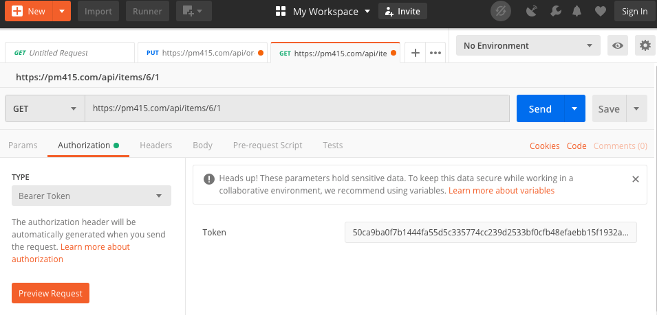

# API overview

## Generating API keys

API keys are generated on the **Settings** page at the bottom of the **Profile** section.

## Downloading Postman

Postman is a great tool for testing API's. Download it from  [**https://www.getpostman.com/downloads**](https://www.getpostman.com/downloads)**.** There are tutorials for getting started at [**https://www.getpostman.com/resources/videos-tutorials/**](https://www.getpostman.com/resources/videos-tutorials/)**.**

## Adding PM415 API keys to Postman

Copy the API key from your PM415 profile and paste it into the Authorization header as shown below. This example shows an API request for item ID: 1 from backlog ID: 6. Review the remainder of the API reference to understand all of the API endpoints available to you.

