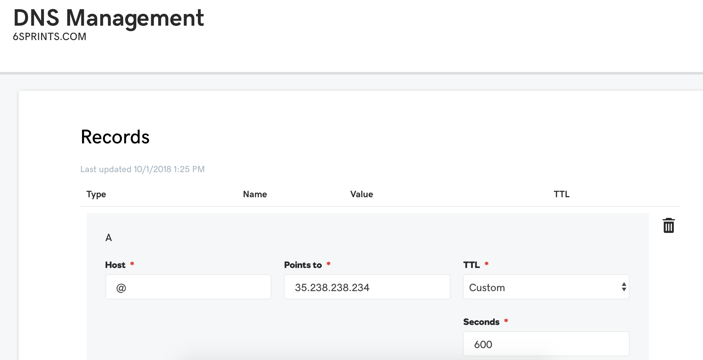

# Kubernetes

## Install and configure docker + gcloud

Follow the instructions to install [docker](https://docs.docker.com/install/) and [gcloud](https://cloud.google.com/sdk/).

Add Google Container Registry to your docker config:

```text
gcloud auth configure-docker
```

Login to your Google account:

```text
gcloud auth login
```

## Build and push container image to GCR

Download the PM415 git repository and change directories

```text
git clone https://github.com/mreider/pm415.git
cd pm415
```

Build a docker image, tag it, and push to Google Container Registry \(GCR\). Replace the tag with your own Google Cloud Project name according to the format documented [here](https://cloud.google.com/container-registry/docs/pushing-and-pulling).

```text
docker build --tag gcr.io/pm415-238921/pm415 .
docker push gcr.io/pm415-238921/pm415
```

## Create a Kubernetes cluster

Login to Google Cloud and navigate to **Kubernetes Engine** 

Choose **Create cluster** 

Choose **Standard cluster** and accept all the defaults 

Click **Create**

## Create a kubectl config

Install **kubectl** using [these instructions](https://kubernetes.io/docs/tasks/tools/install-kubectl/) 

Return to the **Kubernetes Engine** page in the Google Cloud Console and click edit icon.


When the edit screen appears - write down the **Endpoint IP address**. 

Click **Show credentials** and copy the certificate to your clipboard In a terminal

Convert the certificate to base64 - the following works on a mac: 

`pbpaste | base64` 

Return to the cluster credential window and copy the admin password

Create a file named `config.yml` with the following contents:

```text
kind: Config
apiVersion: v1

clusters:
- cluster:
    server: https://(paste the endpoint IP address)
    certificate-authority-data: (paste the base64 cert here)
 name: default

current-context: default
contexts:
- context:
    cluster: default
    namespace: default
    user: default
  name: default

users:
- name: default
  user:
    username: admin
    password: (paste the admin password here)
```

## Test your config

Create the **KUBECONFIG** environment variable to reference your config: 

```text
export KUBECONFIG=~/config.yml 
```

Test your config 

```text
kubectl get node
```

This should return the list of Kubernetes nodes in your Google Cloud account.

```text

NAME                                                STATUS    ROLES     AGE       VERSION
gke-standard-cluster-1-444   Ready     <none>    22m       v1.11.8-gke.6
gke-standard-cluster-1-445   Ready     <none>    23m       v1.11.8-gke.6
gke-standard-cluster-1-446   Ready     <none>    23m       v1.11.8-gke.6
```

## Create Kubernetes secrets

PM415 deployments have a few different secrets to reference.

```text
kubectl create secret generic mysql --from-literal=password=RADOM_PASSWORD
kubectl create secret generic sendgrid --from-literal=password=YOUR_PASSWORD
kubectl create secret generic appkey --from-literal=password=RANDOM_KEY
```

## Create pods

Edit the file `pm415.yaml` and replace the following values with your information. If you do not change the DOMAIN\_URL to a valid domain - the installation will fail CORS security rules.

```text
          - name: DOMAIN_URL
            value: your-domain.com
          - name: SENDGRID_USERNAME
            value: your-sendgrid-account
```

Create pods from the PM415 directory

```text
 kubectl create -f mysql.yaml
 kubectl create -f es.yaml
 kubectl create -f pm415.yaml
```

## Check the status of your pods

Check all of your pods to see if any are failing. If you see evictions, you might be running out of resources.

```text
kubectl get pods --all-namespaces
```

Use the describe command to see specific error messages for a pod

```text
kubectl describe pod pm415-575765d57b-g2pkg
```

## Expose pods as services

This will expose two internal ip's for MySQL and ElasticSearch, and a Load Balancer for PM415.

```text
kubectl create -f mysql-service.yaml
kubectl create -f elastic-search-service.yaml
kubectl create -f pm415.yaml
```

## Get IP address and configure DNS

Wait a few minutes and then run this command to get the PM415 load balancer IP address:

```text
kubectl get svc -l app=pm415
```

This will return information like the following:

```text
pm415     LoadBalancer   10.7.250.50   35.238.238.234   80:31851/TCP   1m
```

Use this IP address for your DNS A record. Make sure this is the same value as the DOMAIN\_URL you set in the `pm415.yml` deployment configuration.



