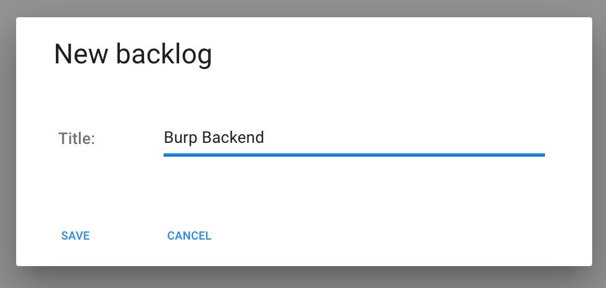
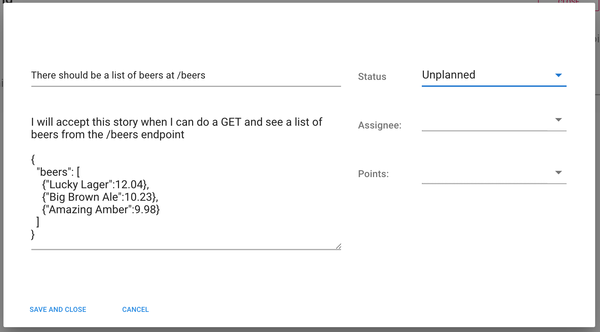
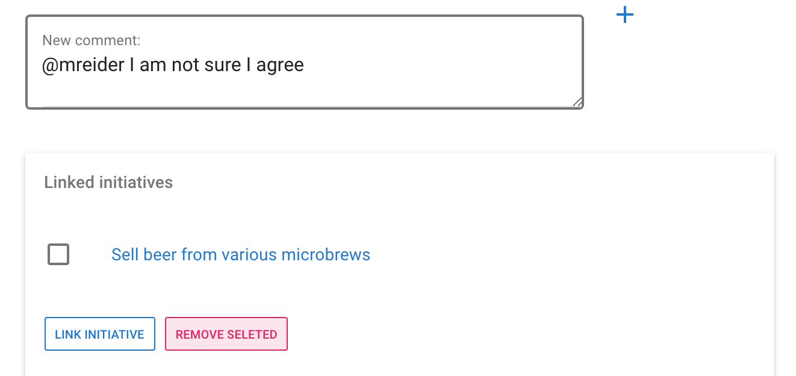
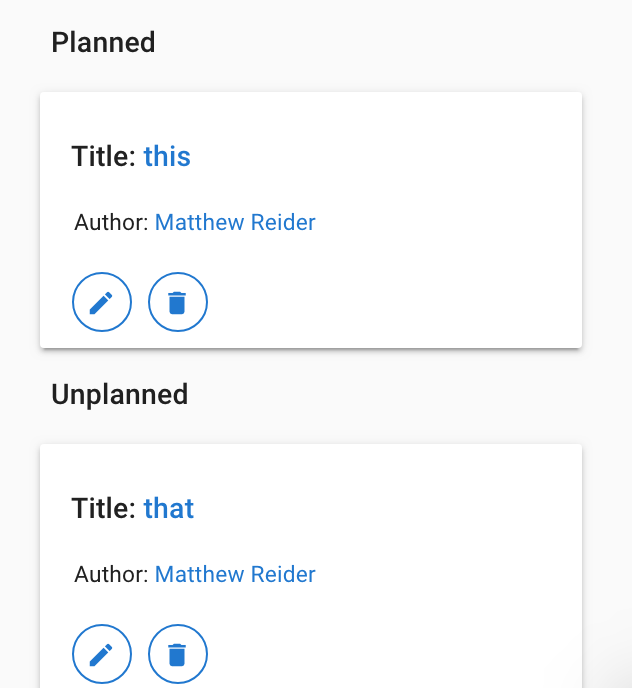

# Backlogs

## Creating a backlog

Backlogs are lists of prioritized items, or user stories. They are managed by a single product manager and used by a single team.

Imagine an engineering department at Burp, a social network for beer drinkers, has organized itself into two teams. The first team, **Burp Backend** is in charge of the Burp API,  database, and business logic.

To create a backlog we choose **Backlog** from the side menu and click **New**.

## Grooming the backlog

Grooming is a process used by product and engineering teams. When an item is groomed, it is understood, pointed, and ready to be worked on.

The Burp Backend team is planning the **Sell Beer** initiative coming up in Q3. The product manager begins by writing user stories in the backlog. The first item is to get a beer list from the API.

This item is marked as **Unplanned** because it has not been groomed with the team. After a discussion, the story could be marked as planned, assigned to an engineer, and given a size, in the form of points.

## Adding links and comments

After a story is created it can be linked to an Initiative and commented on.

## Story lifecycle

You can drag and drop stories from different status sections as you move through the story lifecycle. Each status is described in order as follows:

1. **Unplanned** stories have not been prioritized nor scheduled for delivery. This is the initial state for every story. It's where unrefined ideas go, and where things pile up waiting to be triaged. Every time the product manager learns about a problem, they write a new story in the unplanned section. Eventually every unplanned story will either be archived, deleted, or planned. 
2. **Planned** stories have been discussed \(groomed\) by the product manager and the engineering lead. This usually happens a few days before a sprint begins. You can point and assign them if you want, but this often happens in a sprint planning meeting, on the first day of the sprint, together with the engineering team. 
3. **Doing** is the status of stories that are currently being worked on. They cannot begin until they have been assigned and pointed. 
4. **Done**  is the status of stories that were delivered successfully.

