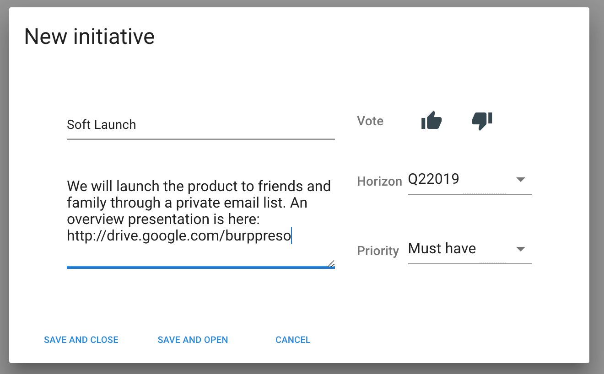
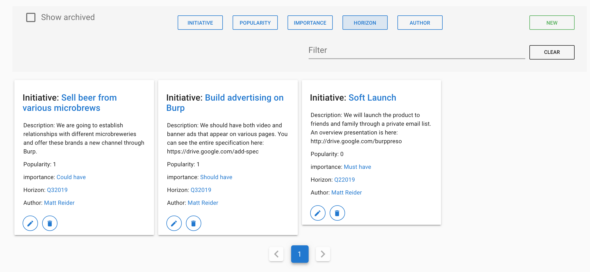

# Initiatives

## Creating Initiatives

Initiatives are related product features that achieve a certain goal. Scrum refers to these as epics.

Imagine the founders of Burp, a social network for beer drinkers, are planing the first version of their product. They decide to ship v1 quietly, to test their assumptions. They create an initiative called **Soft Launch** planned for a **Q2 horizon**, as a **must have** based on promises made to their investors.

To create an initiative we choose **Initiatives** from the side menu and click **New**.

## Planning new initiatives

After launch - the team plans the next initiative. There are two competing ideas. One is to promote and sell microbrewery beer. The other is to sell advertising. The team creates two initiatives and uses **the voting feature** to decide what to do.

In sorting initiatives by popularity \(votes\), priority, and expected timelines, the team make decisions and talk about what to do next.

