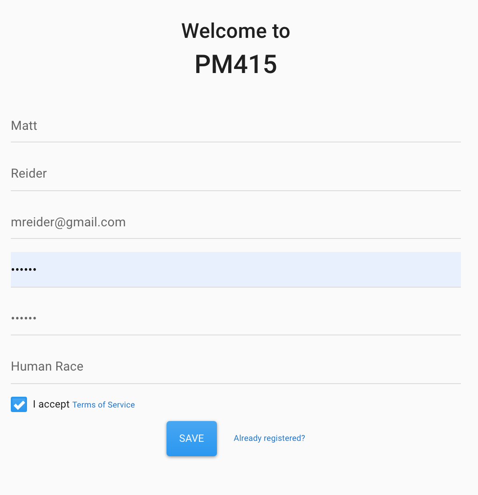
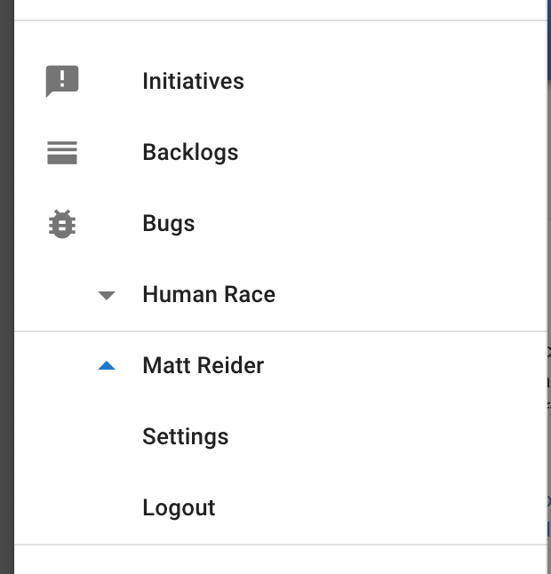
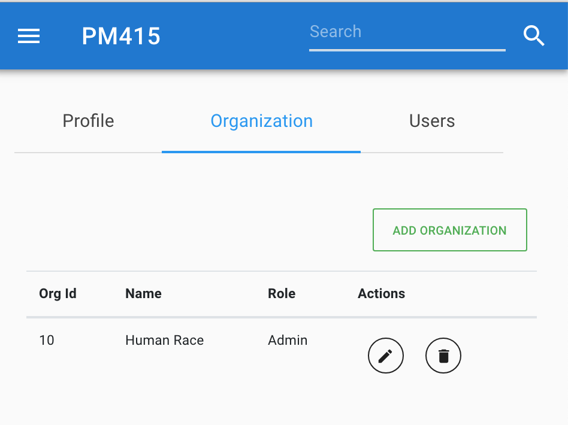
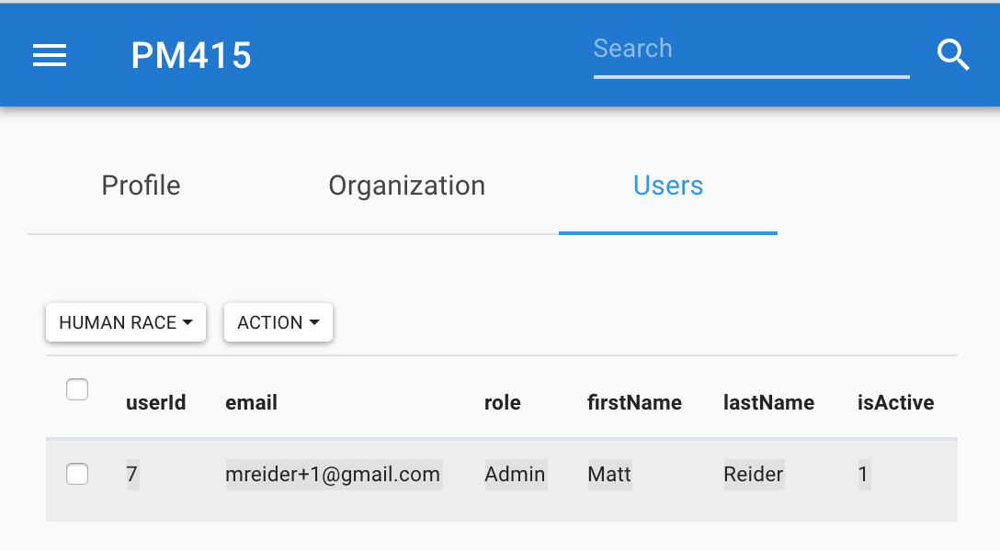
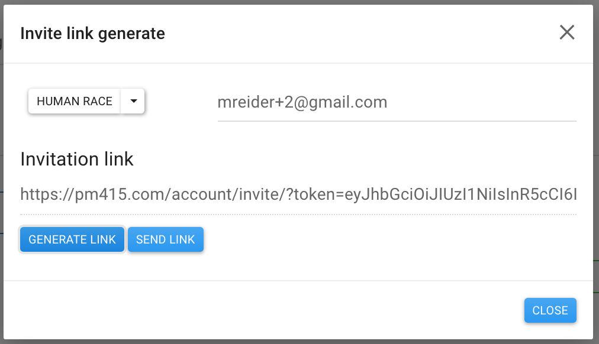

# User management

## Registering your organization

Choose the **Not registered** link on the login page, enter your name, email, and organization name. Wait for an email and verify your account. You are now the owner of the organization.

## Managing organizations and users

Organization and user management is accessed via **Settings**.

### Adding new organizations

Choose the Organization tab to manage or add new organizations.

### Managing users

Choose the Users tab to manage users

### Inviting users

Choose **Invite Link** from the **Settings** page and enter the new user's information. 

## 

